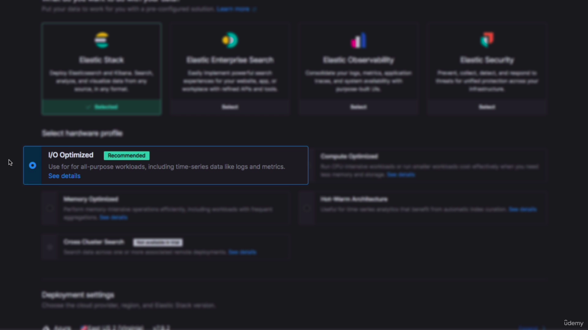

### Easy Method 
___
Cloud setup for 14 day free trail - <a href="https://www.elastic.co/cloud/cloud-trial-overview?medium=email&campaign=marketo-fallback">Elastic Cloud Trail<a/>

  Steps -
  * Login /Signup on above website.
  * Verify Email
  * Set password
  * You redirected to Elastic cloud console
  * Click on start free trail
  * Select Elastic Stack 
  * Select hardware profile as default one 
  * Make Deployment settings as same/default 
  * You get ES deployment creds - download them as they visible only once 
  * Your ES configured now 
  * You can open Kibana dashboard too with sample data.
  
### Traditional Method 
___
**Download ES** - <a href="https://www.elastic.co/downloads/elasticsearch">Elastic Download Page<a/>

  
**Download Kibana** - <a href="https://www.elastic.co/downloads/kibana">Kibana Download Page<a/>
 
  Steps -
  * 
